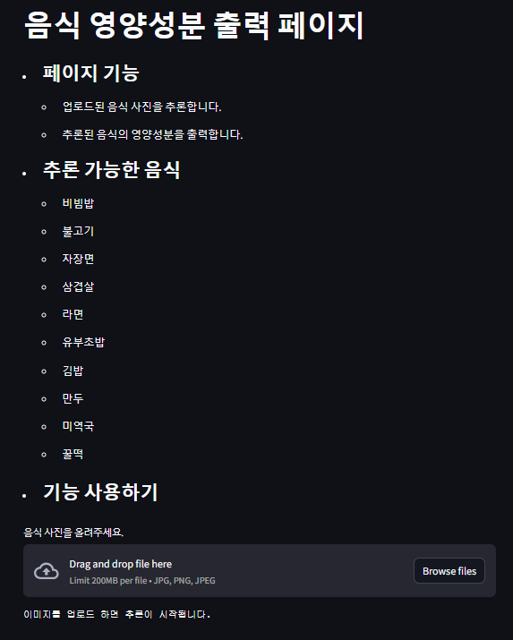

# Food Image Classification with ResNet of Pytorch
Pytorch Tutorial의 **기본 CNN 모델**과 **ResNet 모델**을 사용한 음식 이미지 분류와 두 모델의 성능 분석 및 ResNet 모델의 이해

## 🔥ResNet?
일반적으로 신경망은 층이 깊을 수록 성능이 높을 거라고 기대합니다. 하지만 ResNet 논문에서 Deeper Model이 Shallower Model에 비해 높은 Training Error를 보였고, 자연스럽게 Test Error 또한 높은 양상을 보였습니다.  Deeper Model이 Training Error가 더 높은 상황이므로 *Overfitting*이 아닙니다. 물론 층이 깊을 수록 *Vanishing Gradient*(기울기 소실)를 고려해야 하지만, ResNet 논문에서 Vanishing Gradient는 이 문제의 주된 원인이 아니라고 주장합니다.

ResNet은 다음 아이디어로 Deeper Model을 우리가 기대하는 방향(깊은 신경망이 더 성능이 좋을 것이다)으로 학습시킬 수 있다고 주장합니다.

* Deeper model을 Shallower model에 *identity mapping*만 쌓은 model이라고 가정했을 때, **Deeper model이 Shallower model 보다 높은 Training Error를 보일 수 없을 것이다**(적어도 같은 Training Error를 보여야 한다)

* 우리가 이상적으로 얻고자 하는 값을 $H(x)$라고 했을 때 $H(x)$를 바로 학습시키는 방법 보다 다음 그림과 같이 *Skip Connection*을 통해 **$H(x) - x$를 학습하는 방법이 더 쉬울 것이다**
   * 나머지(residual)를 학습함으로써 빠른 학습이 가능함
    * *identity mapping* 유도
      


    

## 🎯The Aim of This Project
* Pytorch Tutorial의 기본 CNN 모델의 음식 이미지 학습
    * 층이 깊을 수록 Train, Test Error의 비교 및 Accuracy 변화 관측
    * cf. [Pytorch CNN Tutorial](https://pytorch.org/tutorials/beginner/blitz/cifar10_tutorial.html)
      
* ResNet 모델의 음식 이미지 학습
    * 층 깊이에 따른 Train, Test Error의 비교 및 Accuracy 변화 관측
    * cf. [github: ResNet](https://github.com/ndb796/Deep-Learning-Paper-Review-and-Practice/tree/master/code_practices)
 
* ResNet은 깊은 층을 어떻게 효율적으로 학습하는가?

## 💾Dataset
* 음식 이미지 데이터
    * 이미지 종류: 10개
    * 이미지 개수: 10*1000개
    * 해당 데이터는 한국지능정보사회진흥원의 사업결과입니다([AI-Hub](https://aihub.or.kr/aihubdata/data/view.do?currMenu=&topMenu=&aihubDataSe=data&dataSetSn=79))
      
* 영양 성분 데이터
    * [식품의약품안전처: 식품영양성분 데이터베이스](https://various.foodsafetykorea.go.kr/nutrient/)

## ⚙️Environment

```toml
python = "^3.11"
torch = "^2.3.0"
torchvision = "^0.18.0"
torchaudio = "^2.3.0"
matplotlib = "^3.9.0"
plotly = "^5.22.0"
streamlit = "^1.35.0"
pyngrok = "^7.1.6"
pandas = "^2.2.2"
```

package denpedecy는 *pyproject.toml*과 *requirements.txt*에 작성 돼 있습니다.

## 🔧Setting The Environment

* Virtual Environment

```powershell
#python venv module
python -m venv {env name}
.\{env name}\Scripts\Activate.ps1

#conda
conda create -n {env name} python={version}
conda activate {env name}

#poetry
poetry shell
```

* Install Packages

   * package manager에 따라 다음 파일이 현재 디렉토리에 포함 돼 있어야 합니다

   * pip, conda: *requirements.txt*

   * poetry: *pyproject.toml*

```powershell
#pip
pip install -r requirements.txt

#conda
conda install --file requirements.txt

#poetry
poetry install
```

## 🗂️Files
```
foodimgclassifier
 ┣ outputs
 ┃ ┣ log.txt
 ┃ ┗ ResNet18.pth
 ┣ src
 ┃ ┣ models
 ┃ ┃ ┣ models.py
 ┃ ┃ ┣ optimizers.py
 ┃ ┃ ┣ preprocess.py
 ┃ ┃ ┗ __init__.py
 ┃ ┣ train.ipynb
 ┃ ┗ __init__.py
 ┣ app.py
 ┣ server.ipynb
 ┗ __init__.py
```

|*File Name*|*Description*|
|-----------|-------------|
|models.py|model class가 정의 돼 있습니다|
|optimizers.py|목적함수와 optimizer가 정의 돼 있습니다|
|preprocess.py|이미지 전처리를 수행합니다|
|train.ipynb|모델 학습 및 오차, 정확도에 대한 그래프를 그립니다|
|app.py|웹 화면에서 기능을 구현합니다|

## 🦎Model 설명

<details> <summary>ShallowNet</summary>
* ShallowNet은 2번의 합성곱을 수행하는 모델입니다. pytorch tutorial에 있는 코드를 참고했으며 ShallowNet.png 파일에 구조를 시각화 하였습니다.
</details>

<details> <summary>DeepNet5</summary>

* DeepNet5는 5번의 합성곱 연산을 수행하는 모델입니다. ShallowNet에 3번의 합성곱 연산만 추가했습니다.
</details>

<details> <summary>DeepNet10</summary>

* DeepNet10은 10번의 합성곱 연산을 수행합니다. 신경망의 깊이가 너무 깊고, 적절한 최적화가 이루어지지 않아 학습이 전혀 일어나지 않습니다.
</details>


<details> <summary>SkipConDeepNet10</summary>

* DeepNet10에 Skip Connection만 흉내내 본 모델입니다. 구현 방식은 정석과 거리가 멀 수 있으나, DeepNet10에 비교하면 학습은 이루어지는 결과를 확인할 수 있습니다.
</details>

<details> <summary>ResNet18</summary>

* ResNet 모델입니다. ResNet의 핵심인 Skip Connection 외에 적절한 최적화가 이루어집니다.
</details>

## 📊Plotly?
그래프를 interactive하게 그려줍니다. 자세한 내용은 다음 링크를 참고하세요.

* [Plotly 공식 페이지](https://plotly.com/python/)
* [Plotly Tutorial](https://wikidocs.net/book/8909)

## streamlit

모델 사용을 간단한 GUI 환경에서 진행하기 위해 사용합니다. Streamlit을 사용하기 위해 app.py 모듈이 위치한 디렉터리로 이동 후 다음 명령어를 사용합니다.

```powershell
streamlit run app.py --server.port 8080
```



학습된 모델은 `foodimgclassifier/outputs/ResNet18.pth`입니다.
